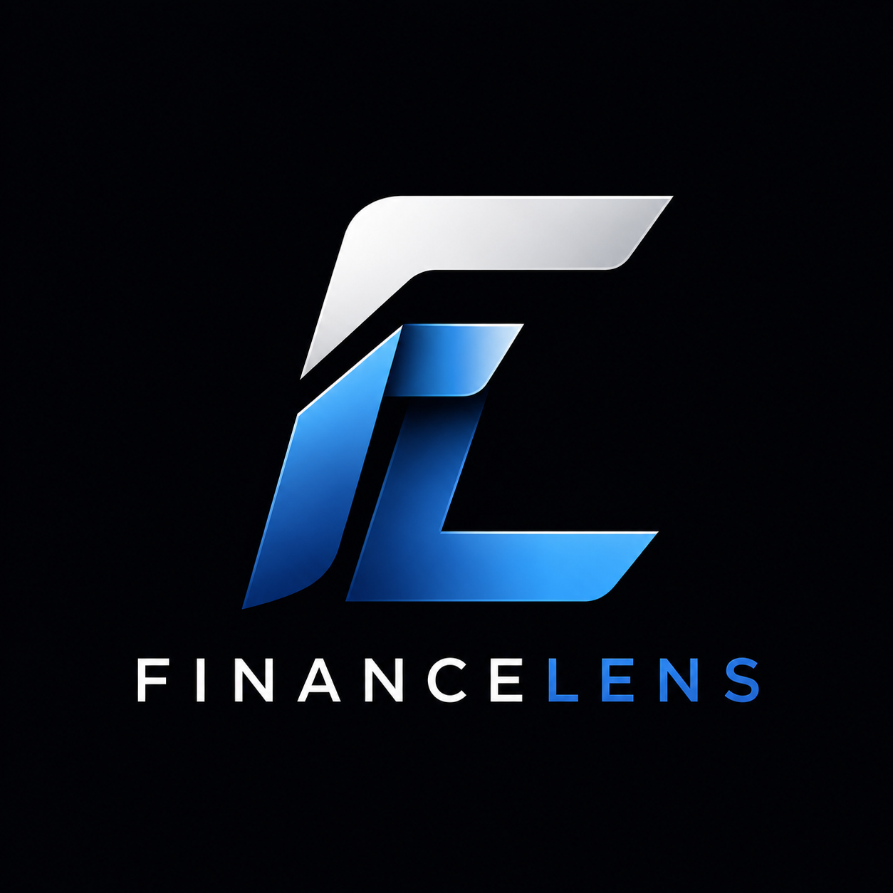
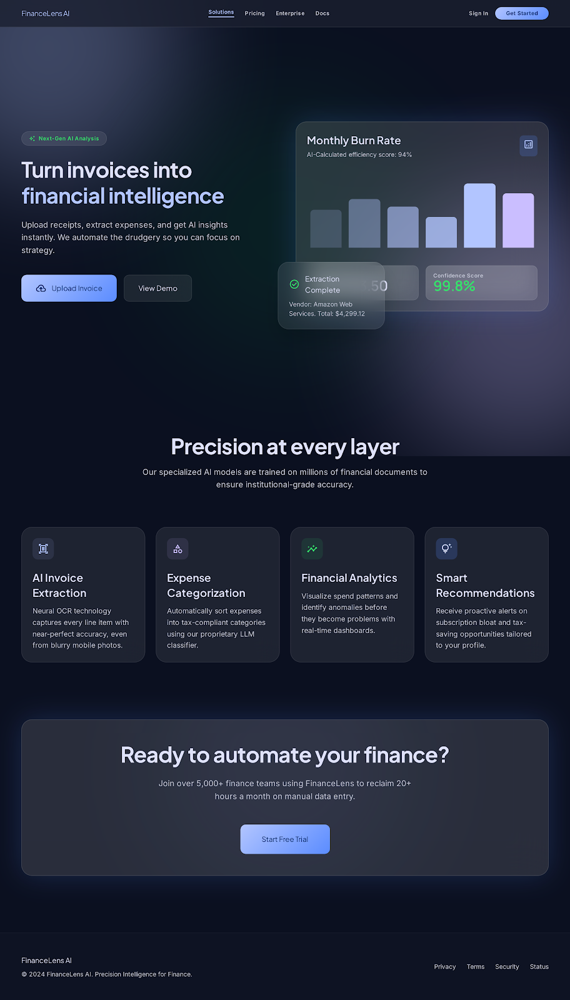
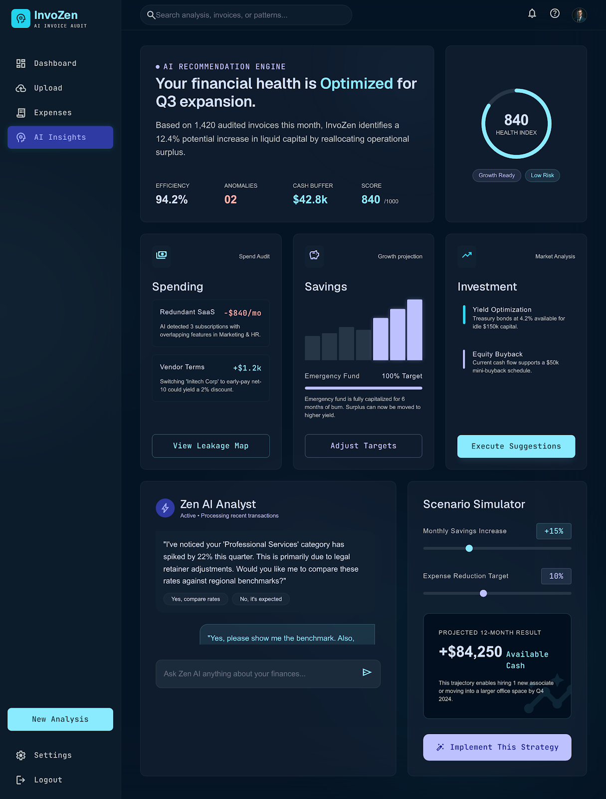
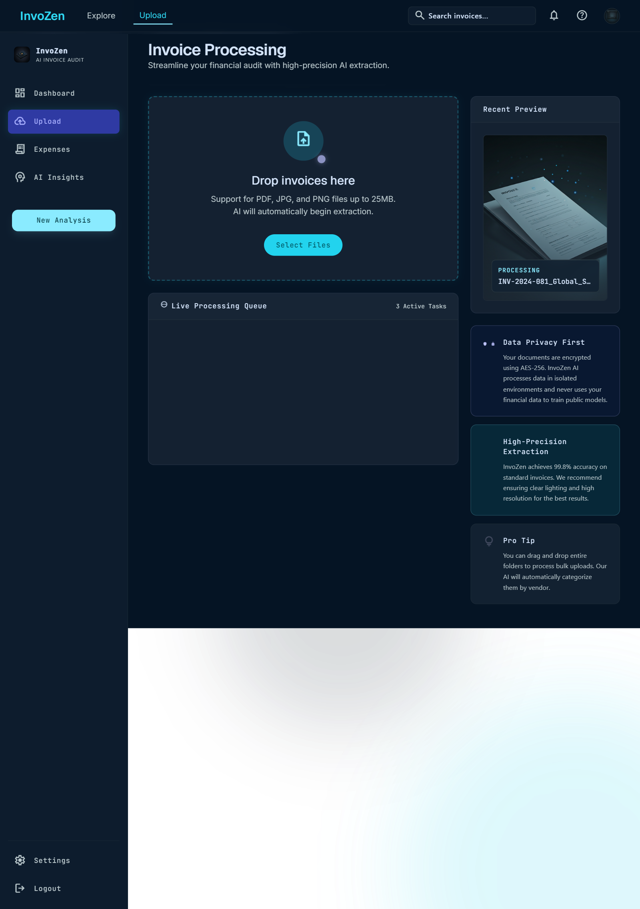
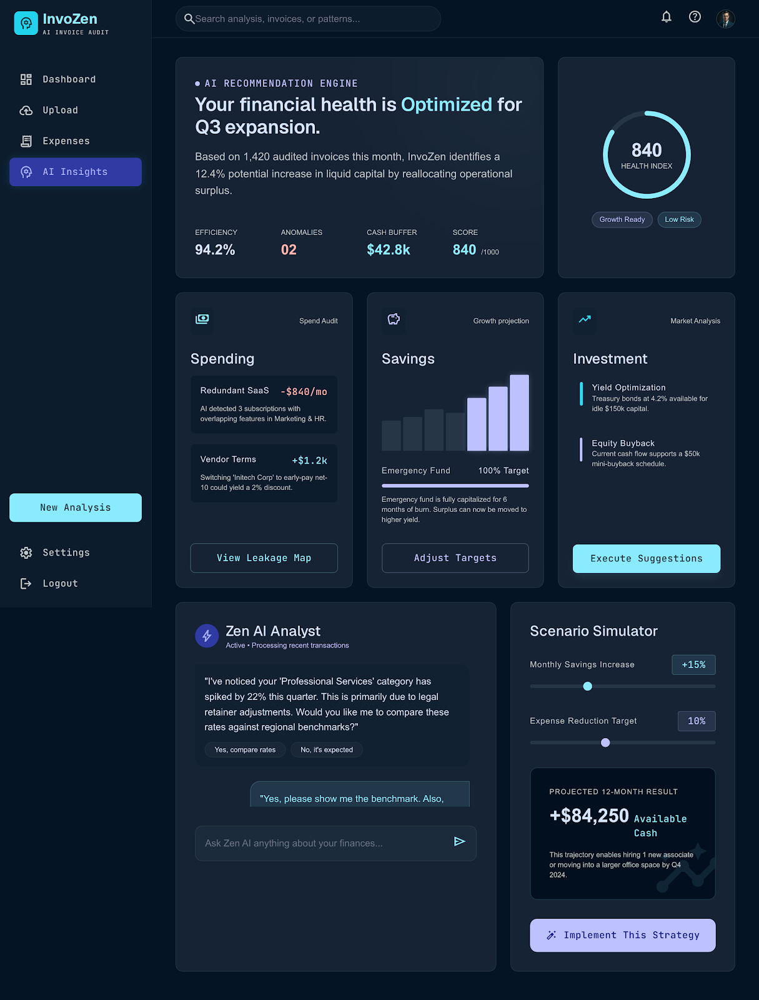
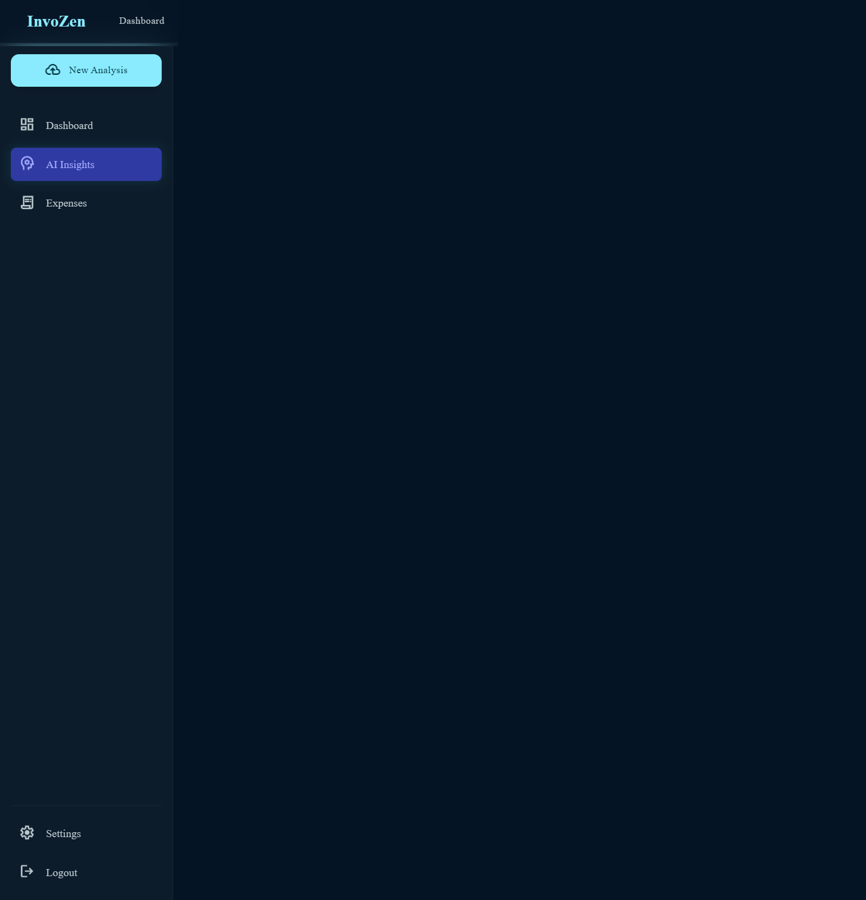
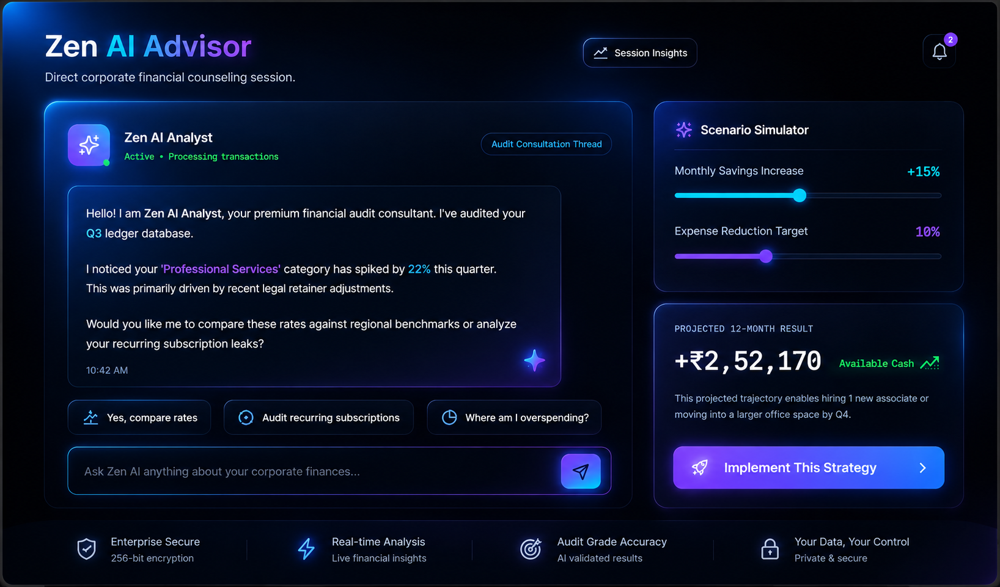
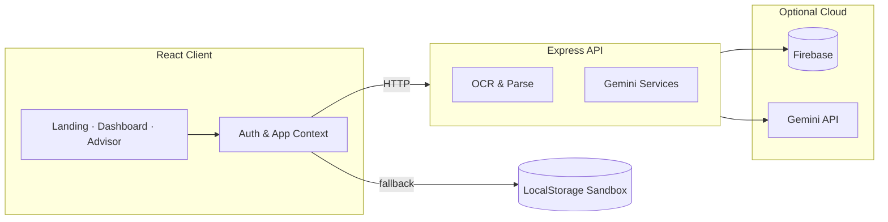

<div align="center">



# 💎 FinanceLens AI

**Turn invoices into financial intelligence.**

[](https://react.dev/)
[](https://www.typescriptlang.org/)
[](https://nodejs.org/)
[](https://tailwindcss.com/)
[](https://ai.google.dev/)

*A production-grade FinTech platform for corporate receipt auditing, spend analytics, and AI-powered financial counseling.*

[✨ Features](#-features) · [📸 Screenshots](#-screenshots) · [🛠️ Stack](#️-tech-stack) · [🚀 Quick Start](#-quick-start) · [🏗️ Architecture](#️-architecture)

</div>

---

## 📖 Overview

**FinanceLens AI** helps finance teams move from manual invoice review to actionable insight in minutes. Upload receipts and invoices (PDF, JPG, PNG), extract structured line items with AI, track budget health, visualize spend patterns, and consult **Zen AI Advisor**—an embedded analyst for anomalies, savings scenarios, and audit-grade recommendations.

The app ships as a full-stack monorepo: a **Vite + React** client with a glassmorphic *Midnight Zen* UI, backed by a **Node.js + Express** API and **Google Gemini** for OCR, categorization, and conversational finance coaching.

---

## 📸 Screenshots

### 🌌 Landing page
*Hero, glass CTAs, and floating analytics preview.*

<p align="center">
  
</p>

### 📊 Dashboard
*KPI cards, spend trends, category breakdown, and live ledger activity.*

<p align="center">
  
</p>

### 📤 Upload center
*Drag-and-drop invoice ingestion with real-time processing queue.*

<p align="center">
  
</p>

### 🧠 AI Insights
*Health gauges, recommendations, and audit-grade summaries.*

<p align="center">
  
</p>

### 📈 Analytics
*Deep-dive charts, tax summaries, and spending heatmaps.*

<p align="center">
  
</p>

### 🤖 Zen AI Advisor
*Glass chat workspace, scenario simulator, and 12-month cash projections.*

<p align="center">
  
</p>

---

## ✨ Features

| Module | What it does |
|--------|----------------|
| 📤 **Upload Center** | Drag-and-drop ingestion (up to 25MB), live upload queues, animated progress |
| 🔍 **OCR Pipeline** | Upload → scan → extract → categorize → insights → complete |
| 📊 **Dashboard** | KPI cards, burn-rate trends, category breakdowns, budget score |
| 🧾 **Expenses & Editor** | Searchable ledger, two-pane metadata editor with `React Hook Form` |
| 📈 **Analytics** | Interactive charts powered by Recharts |
| 💡 **AI Insights** | Automated flags, patterns, and narrative summaries |
| 🤖 **Zen AI Advisor** | Glass UI chat with scenario sliders, 12-month projections, suggested prompts |
| 🧪 **Sandbox Mode** | Full offline fallback via LocalStorage when the API is unavailable |

---

## 🛠️ Tech Stack

<details>
<summary><strong>⚛️ Frontend</strong></summary>

- React 19 · Vite · TypeScript  
- Tailwind CSS v4 (glass panels, neon glows, custom theme tokens)  
- Framer Motion · Recharts · React Hook Form · Lucide Icons  

</details>

<details>
<summary><strong>🖥️ Backend</strong></summary>

- Node.js · Express · TypeScript  
- Multer · PDF parsing  
- Google Generative AI (Gemini) for OCR, NLP categorization, and advisor chat  
- Firebase Auth · Firestore · Storage (cloud mode)  

</details>

---

## 🏗️ Architecture



---

## 🚀 Quick Start

**Prerequisites:** [Node.js 22+](https://nodejs.org/)

### 1️⃣ Clone the repository

```bash
git clone https://github.com/AYUSHMANGH/CODEFLOW2026-NomadCoders-AIBasedInvoiceAnalyzer.git
cd CODEFLOW2026-NomadCoders-AIBasedInvoiceAnalyzer
```

### 2️⃣ Start the API

```bash
cd backend
npm install
npm run dev
```

Runs at **`http://localhost:5000`**

### 3️⃣ Start the client

In a second terminal:

```bash
cd frontend
npm install
npm run dev
```

Opens at **`http://localhost:5173`**

### 🔐 Environment (optional)

For cloud AI and Firebase, configure credentials in the backend and frontend per your deployment setup. Without them, the client automatically uses **sandbox mode** so you can explore the full UI locally.

---

## 📁 Project Structure

```
├── backend/              # Express API — routes, controllers, Gemini & OCR services
├── frontend/             # React app — pages, glass UI components, contexts
├── docs/screenshots/     # README UI previews
├── ui designs/           # Design references and mockups
└── README.md
```

---

## 🎨 Design Language

FinanceLens uses a **Midnight Zen** aesthetic: deep cosmic backgrounds, frosted-glass surfaces, cyan–violet gradients, and soft blue ambient lighting. The Zen AI Advisor page pairs a contained chat workspace with a scenario simulator and projected cash-flow outcomes—built for clarity during long audit sessions.

---

## 🤝 Contributing

Issues and pull requests are welcome. Please open an issue first for large changes so we can align on scope.

---

## 📄 License

ISC

---

<div align="center">

**Built for CODEFLOW 2026 · Nomad Coders** 🚀

[🐛 Report a bug](https://github.com/AYUSHMANGH/CODEFLOW2026-NomadCoders-AIBasedInvoiceAnalyzer/issues) · [⭐ View repository](https://github.com/AYUSHMANGH/CODEFLOW2026-NomadCoders-AIBasedInvoiceAnalyzer)

</div>
